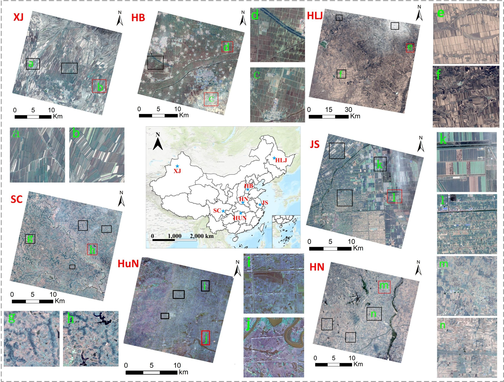

# HBGNet

A large-scale VHR parcel dataset and a novel hierarchical semantic boundary-guided network for agricultural parcel delineation ((https://www.sciencedirect.com/science/article/pii/S0924271625000395)

[Project](https://github.com/NanNanmei/HBGNet)

## Introduction

We develop a hierarchical semantic boundary-guided network (HBGNet) to fully leverage boundary semantics, thereby improving AP delineation. It integrates two branches, a core branch of AP feature extraction and an auxiliary branch related to boundary feature mining. Specifically, the boundary extract branch employes a module based on Laplace convolution operator to enhance the model’s awareness of parcel boundary.

<p align="center">
  
</p>

<p align="center">
  
</p>

## Using the code:

The code is stable while using Python 3.9.0, CUDA >=11.4

- Clone this repository:
```bash
git clone https://github.com/NanNanmei/HBGNet.git
cd HBGNet
```

To install all the dependencies using conda or pip:

```
PyTorch
OpenCV
numpy
tqdm
timm
...
```

## Preprocessing
You can use the https://github.com/long123524/BsiNet-torch/blob/main/preprocess.py to obtain contour and distance maps.

## Data Format

Make sure to put the files as the following structure:

```
inputs
└── <train>
    ├── train_dist
    |   ├── 001.tif
    │   ├── 002.tif
    │   ├── 003.tif
    │   ├── ...
    |
    └── train_mask
    |   ├── 001.tif
    |   ├── 002.tif
    |   ├── 003.tif
    |   ├── ...
    └── train_boundary
    |   ├── 001.tif
    |   ├── 002.tif
    |   ├── 003.tif
    |   ├── ...
    └── train_dist
    |   ├── 001.tif
    |   ├── 002.tif
    |   ├── 003.tif
    └── ├── ...
```

For test datasets, the same structure as the above.

## Pretrained weight

The weight of PVT-V2 pretrained on ImageNet dataset can be downloaded from: https://drive.google.com/file/d/1uzeVfA4gEQ772vzLntnkqvWePSw84F6y/view?usp=sharing

### A large-scale VHR parcel dataset dataset
The beautiful vision for FHAPD is that it will be a continuously updated dataset for different agricultural landscapes in China. At present, I have carried out many AP delineation works in different regions of China using HBGNet, such as Shanghai, Inner Mongolia, Guangdong, Shandong and Gansu, and will update it immediately after the official publication of this article. 
I also built an APs dataset for the African and tried to add it to the FHAPD as a personality region.

Link: https://pan.baidu.com/s/1OS7G0H27zGexxRfqTcKizw?pwd=8die code: 8die

If you have any problem, please email to zhaohang201@mails.ucas.ac.cn.

## Training and testing

1. Train the model.
```
python train.py
```
2. Test the model.
```
python test.py
```
### Citation:
If you find this work useful or interesting, please consider citing the following references.
```
Citation 1：
@article{zhao2025,
  title={A large-scale VHR parcel dataset and a novel hierarchical semantic boundary-guided network for agricultural parcel delineation},
  author={Zhao, Hang and Wu, Bingfang and Zhang, Miao and Long, Jiang and Tian, Fuyou and Xie, Yan and Zeng, Hongwei and Zheng, Zhaoju and Ma, Zonghan and Wang, Mingxing and others},
  journal={ISPRS Journal of Photogrammetry and Remote Sensing},
  volume={221},
  pages={1--19},
  year={2025},
  publisher={Elsevier}
}
Citation 2：
@article{zhao2024,
  title={Irregular agricultural field delineation using a dual-branch architecture from high-resolution remote sensing images},
  author={Zhao, Hang and Long, Jiang and Zhang, Miao and Wu, Bingfang and Xu, Chenxi and Tian, Fuyou and Ma, Zonghan},
  journal={IEEE Geoscience and Remote Sensing Letters},
  volume={21},
  pages={1--5},
  year={2024},
  publisher={IEEE}
}
Citation 3：
@article{long2024,
  title={Integrating Segment Anything Model derived boundary prior and high-level semantics for cropland extraction from high-resolution remote sensing images},
  author={Long, Jiang and Zhao, Hang and Li, Mengmeng and Wang, Xiaoqin and Lu, Chengwen},
  journal={IEEE Geoscience and Remote Sensing Letters},
  volume={21},
  pages={1--5},
  year={2024},
  publisher={IEEE}
}
```

###  Acknowledgement
We are very grateful for these excellent works [BsiNet](https://github.com/long123524/BsiNet-torch), [SEANet](https://github.com/long123524/SEANet_torch), and [HGINet](https://github.com/long123524/HGINet-torch), which have provided the basis for our framework.
